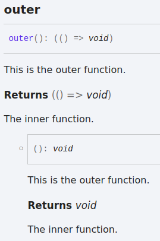
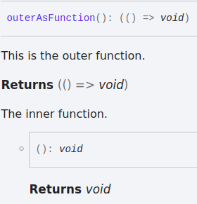

# Typedoc returned function MWE

When a class method returns another function, typedoc documents the returned function weirdly: it copies the outer method's docs.

Code (`src/index.ts`):

```ts
export class ClassVersion {
  /**
   * This is the outer function.
   *
   * @returns The inner function.
   */
  outer(): () => void {
    /** Docs for the inner function? */
    return () => {};
  }
}
```

Generated docs (`docs/classes/ClassVersion.html`):



If the outer function is a standalone function instead of a class method, it behaves as I would expect:

```ts
/**
 * This is the outer function.
 *
 * @returns The inner function.
 */
export function outerAsFunction(): () => void {
  /** Docs for the inner function? */
  return () => {};
}
```


